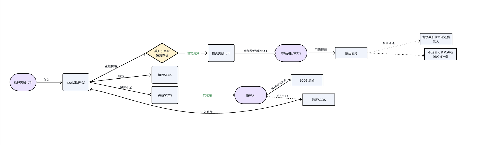

# SCOS
SCOS是一个 以美股代币化资产为抵押，发行稳定币的CDP协议，可以理解为「美股 Token 版的 MakerDAO」。  

### 功能
- 以美股代币资产为抵押，发行稳定币
- 支持质押和赎回
- 支持用户使用稳定币买卖美股代币

### 架构图


```shell
Reddio 合约地址:
   scos: 0xeB5e9Af4b798ec27A0f24DA22C7A7b3b657D05d9
   APPLE: 0xE49f7C3b573bb2a4A54dbCCA9c06e5fc84C537DD
   StockVault: 0x0fE2B0c6177c79278A70E825581c691856E932D3
```


## 部署说明
1. 环境要求  
   - Node.js 16+   
   - Go 1.21+  
   - Solidity编译器  
  

2. 智能合约部署
```shell
# 安装Hardhat或Truffle
npm install -g hardhat

# 编译合约
npx hardhat compile

# 部署合约
npx hardhat run scripts/deploy.js --network <network_name>
```

3. 后端部署
```shell

# 安装依赖
go mod tidy

# 设置环境变量 (私钥已写死，只需设置合约地址)
export CONTRACT_ADDRESS="deployed_vault_contract_address"
export SCOS_ADDRESS="deployed_scos_contract_address"

# 运行服务器

go run main.go

```

4. 前端部署
```
npx http-server -p 3000
```

合约部署脚本 (deploy.js)
```
npx hardhat run scripts/deploy.js --network reddio

npx hardhat run scripts/deploy.js --network scrollSepolia

```


API文档

1. 获取Stock价格
```
   GET /api/stock/{symbol}/price
   Response: {
     "symbol": "STOCK",
     "price": 100.0,
     "updated_at": "2024-01-01T00:00:00Z"
   }
```   
2. 更新Stock价格 (管理员)
```shell
   POST /api/stock/{symbol}/price
      Body: {
        "price": 120.0
      }
```
   
3. 获取用户SCOS余额
```shell
   GET /api/user/{address}/scos
   Response: {
     "address": "0x...",
     "scos_balance": 1000.0,
     "active_stakes": 2
   }
```
4. 质押Stock
```shell
  POST /api/stake
     Body: {
       "user_address": "0x...",
       "token_address": "0x...",
       "chain": "ethereum",
       "amount": "100",
       "contract_address": "0x..."
     }
```
   
5. 赎回Stock
```shell
   POST /api/redeem
   Body: {
     "user_address": "0x...",
     "token_address": "0x...",
     "chain": "ethereum",
     "contract_address": "0x..."
   }
```
6. 买入Stock
```shell
   POST /api/buy
   Body: {
     "user_address": "0x...",
     "token_address": "0x...",
     "chain": "ethereum",
     "amount": "100",
     "contract_address": "0x..."
   }
```
7. 卖出Stock
```shell
   POST /api/sell
   Body: {
     "user_address": "0x...",
     "token_address": "0x...",
     "chain": "ethereum",
     "amount": "100",
     "contract_address": "0x..."
   }
```
